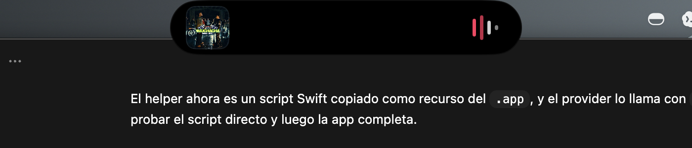
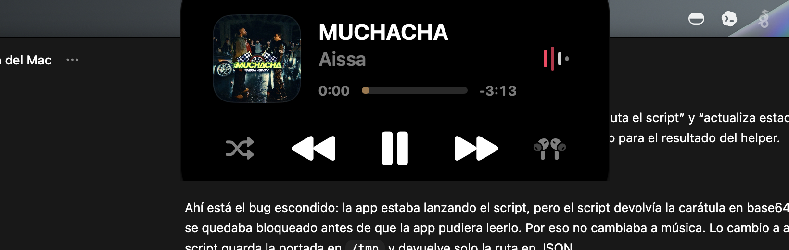

# Notch Mac

Notch Mac es un prototipo personal de una app nativa para macOS inspirada en Alcove. La idea no es copiar la Dynamic Island del iPhone, sino aprovechar la forma real del notch del Mac: una pieza negra pegada al borde superior que se expande hacia abajo cuando hay contenido util.





## Que hace ahora

- Se coloca automaticamente sobre el notch real del Mac usando `NSScreen.auxiliaryTopLeftArea` y `NSScreen.auxiliaryTopRightArea`.
- Vive solo en la barra de menu, sin icono permanente en el Dock.
- Detecta `Now Playing` global mediante un helper Swift que usa `MediaRemote`.
- Muestra una vista compacta con portada a la izquierda e indicador de audio a la derecha.
- Se expande al hover o con `Option + Space`.
- En modo expandido muestra portada, titulo, artista, progreso y controles.
- Permite `play/pause`, anterior y siguiente.
- Acepta archivos arrastrados al notch y los guarda en una bandeja temporal.
- Pide permisos de notificaciones y accesibilidad en el primer arranque.

## Requisitos

- macOS reciente con Swift instalado.
- Xcode o Command Line Tools.
- Un Mac con notch para ver el ajuste real.

Comprueba Swift con:

```bash
swift --version
```

## Ejecutar en desarrollo

Desde la raiz del proyecto:

```bash
swift build --product NotchApp
swift run NotchApp
```

Para abrirla como una app macOS normal:

```bash
chmod +x scripts/build-app.sh
scripts/build-app.sh
open .build/NotchApp.app
```

El script genera:

```text
.build/NotchApp.app
```

## Uso

- Pon musica o video en cualquier app compatible con el sistema Now Playing.
- La vista compacta aparece en la zona del notch con portada e indicador.
- Pasa el raton encima para expandir el panel.
- Usa `Option + Space` para fijar o contraer el panel.
- Arrastra archivos encima del notch para guardarlos en la bandeja.
- Usa el icono de barra de menu para mostrar/ocultar la isla, calibrar posicion o salir.

## Estructura

```text
Package.swift
Resources/media_remote_probe.swift
Sources/NotchApp/
scripts/build-app.sh
docs/V1_PLAN.md
screenshots/
```

Piezas principales:

- `NotchWindowController`: crea el panel flotante y lo posiciona sobre el notch.
- `NotchIslandView`: renderiza el notch compacto, media y expansion.
- `MediaRemoteNowPlayingProvider`: lee Now Playing y envia comandos de media.
- `media_remote_probe.swift`: helper experimental para leer metadata global.
- `FileStashService`: guarda archivos arrastrados al notch.
- `PermissionsService`: solicita permisos iniciales.

## Limitaciones

`MediaRemote` es una API privada de macOS. Para una app personal sirve como experimento, pero no es una base segura para App Store y podria romperse con actualizaciones del sistema.

El helper actual usa `/usr/bin/swift` para desbloquear la lectura global de Now Playing en prototipo. Funciona para desarrollo, pero una version pulida deberia reemplazarlo por una integracion mas robusta.

macOS no ofrece una API publica limpia para leer todas las notificaciones de otras apps. Esa parte queda como investigacion experimental.

## Roadmap

- Pulir animaciones y tamanos para parecerse mas a Alcove.
- Mejorar el helper de Now Playing para que sea mas rapido y estable.
- Anadir volumen, brillo, AirPods y bateria.
- Anadir ajustes persistentes de tamano, hover y pantalla.
- Investigar notificaciones externas de forma segura para uso personal.
